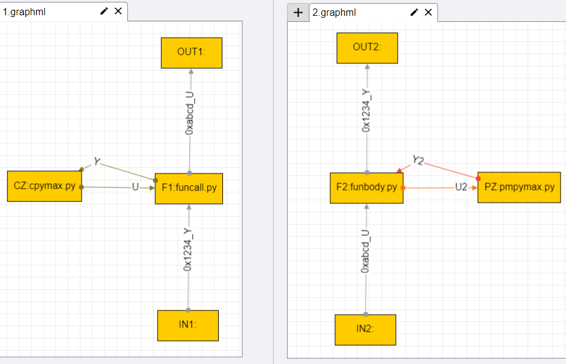

# Alaska: Google Summer of Code (GSoC) 
This is our first time participating as a mentoring organization in the Google Summer of Code (GSoC) as "Alaska." We consist of stable open-source projects in production use in research and relatively young projects. We also have mentors who have participated in several GSoC instances.

We represent the 49th state, Alaska. Anchorage, the largest city in Alaska, has a vibrant open-source community. Through this GSoC initiative, industrial experts that are part of [Alaska Developer Alliance](https://www.akdevalliance.com/) and faculty and researchers from the [University of Alaska Anchorage (UAA)](https://www.uaa.alaska.edu/) join hands, to provide a perfect mentoring experience for interested contributors globally. We hope to provide a glimpse of this northern state and its tech landscape to the Lower 48 and the outside world through this summer internship program organized by Google.

Please refer to the [contributor guidelines](/CONTRIBUTOR-GUIDE.md) for more details on how to apply and a standard template for the application. Please carefully review this [introductory presentation on GSoC](https://pradeeban.github.io/projects/), especially if you are new to GSoC and need some pointers/help on getting started.

The ideal way to contact the mentors is to use the Discussion Forums listed under each project idea. If you would like to introduce yourself, post them [here](https://github.com/uaanchorage/GSoC/discussions/1). If you have questions beyond the general introduction, start a [separate thread](https://github.com/uaanchorage/GSoC/discussions/). Please use these discussion forums rather than individual private emails (unless recommended by the mentor) to boost the open-source environment.

Many of the ideas proposed here have a research component. Contributors who work on these ideas have the potential to author a research paper (as the first author, working with the researchers from the University of Alaska) or become co-authors in our ongoing research papers. We strongly encourage those interested in higher studies or research careers to apply for their GSoC with us.

# List of Ideas

**[1] Automated coastline extraction for erosion modeling in Alaska.**

**Mentors:** Frank Witmer (fwitmer -at- alaska.edu)

**Overview:** The rapidly warming Arctic is leading to increased rates of coastal erosion, placing hundreds of Alaska communities at the frontline of climate change. Understanding current rates of coastline change and accurately forecasting future changes is critical for communities to mitigate and adapt to these changes. Current modeling approaches typically use a simple linear model based solely on historical coastline positions to measure rates of change and extrapolate them into the future. In doing so, these models fail to capture the dynamic effects associated with decreasing sea ice, increasing annual wave energy, and increasing temperatures. To improve the quality of these coastal models, we need to increase the quantity of digitized coastlines, but the process of manual photointerpretation is slow and laborious.

**Current Status:** An initial model and pipeline has been developed to automatically extract coastlines from PlanetLabs imagery. The current approach uses a simple Normalized Difference Water Index (NDWI) thresholding technique and a more complex DeepWaterMap algorithm. The DeepWaterMap algorithm was re-trained using finer resolution satellite imagery and two sets of labeled training data. One set of labels is based on a Global Surface Water (GSW) dataset, and the other set of labeled imagery is created from a sliding window NDWI thresholding method. The GSW model training is finished, but there is still more work to be done on the NDWI thresholding method.

**Expected Outcomes:** A finished model with high accuracy that automatically extracts a vectorized coastline representation from PlanetLabs satellite imagery. Then, the model can be applied to large amounts of imagery to model coastline changes over time.

**Required Skills:** Python 

**Code Challenge:** Experience with multi-band satellite imagery, geospatial data processing, and machine learning.

**Source Code:** https://github.com/fwitmer/CoastlineExtraction

**Discussion Forum:** https://github.com/fwitmer/CoastlineExtraction/discussions

**Effort:** 350 Hours

**Difficulty Level:** Medium

***

**[2] Making ZeroMQ a first-class feature of concore.**

**Mentors:** Mark Arnold (markgarnold -at- yahoo.com) and Pradeeban Kathiravelu (pkathiravelu -at- alaska.edu)

**Overview:** [concore](https://github.com/ControlCore-Project/concore) is a lightweight framework for closed-loop peripheral neuromodulation control systems. _concore_ consists of a file-sharing based _concore_ protocol to communicate between the programs in a study. _concore_ also allows a shared-memory based communication between programs. This project will implement a [ZeroMQ](https://zeromq.org/)-based communication between programs, as an alternative to the file-sharing based and shared-memory based communications. ZeroMQ is a message-oriented middleware implemented in multiple languages, which natively supports communications across computing nodes. Such an implementation will improve the usability of _concore_ in distributed environments.

**Current Status:** We experimented with an [osparc-control](https://pypi.org/project/osparc-control/0.0.2/) based communication as an alternative to this default file-sharing based concore protocol. [osparc-control](https://github.com/ITISFoundation/osparc-control) is an extension of ZeroMQ. Our experimental osparc-control based implementation replaces the file-sharing mechanism restricted to one local machine with message queues that can be transmitted between locally networked machines. The contributor will use this osparc-control based communication as an inspiration for the proposed ZeroMQ-based implementation, which will function as a first-class approach to implement the edges of concore without using osparc-control. In our current experimental [osparc-control based implementation](https://github.com/ControlCore-Project/concore/tree/main/0mq), these ZeroMQ edges are not visible in the _concore_ editor, the browser-based visual editor for _concore_. Consequently, studies with osparc-control are represented as forests instead of directed hypergraphs due to the "invisible" ZeroMQ communication. This also means to run a concore study with ZeroMQ communication, we have to run each hypergraph in the forest separately.

**Expected Outcomes:** We need to promote a unified experience in concore, whether the edges are implemented via the default file-sharing approach, shared-memory approach, or through this ZeroMQ message-based approach. In the _concore_ file-sharing approach, we label the edges with alphabetical characters. In the _concore_ shared-memory approach, we label the edges starting with positive decimal integers (specifying the memory channels used for the sharing). Therefore, to denote the _concore_ ZeroMQ-based edges, the contributor should assume that all the ZeroMQ-edges must start with "0" in their labels, followed by a hexadecimal port, followed by an underscore (_). For example, edge 0x1234_Y assigns the logical Y to port 1234 and edge 0xabcd_U assigns the logical U to port abcd. Once such a graph with ZeroMQ-edges is made (a single directed hypergraph, rather than a forest with disjoint two or more directed hypergraphs), we should be able to seamlessly build and run the study regardless of the underlying communication mechanism. Thus, we aim to demonstrate the possibility of a seamless local vs. distributed execution in a cluster through ZeroMQ.

As the expected outcome of this project, we propose a ZeroMQ-based communication for _concore_ with Python. In addition, the contributor may also implement the ZeroMQ-based communication with other programming languages supported by _concore_ such as Matlab and C++. The contributor may also get inspiration from how the shared-memory based communication is implemented in _concore_.

**Required Skills:** Python

**Code Challenge:** Prior experience in Python must be demonstrated. Prior experience with message-oriented middleware frameworks such as ZeroMQ can be a plus, although not mandatory.

**Source Code:**  https://github.com/ControlCore-Project/concore

**Discussion Forum**: https://github.com/ControlCore-Project/concore/discussions

**Effort:** 350 Hours

**Difficulty Level:** Medium

***

**[3] Dynamic DICOM Endpoints.**

**Mentors:** Pradeeban Kathiravelu (pkathiravelu -at- alaska.edu) and Ananth Reddy (bananthreddy30 -at- gmail.com)

**Overview:** DICOM (Digital Imaging and Communications in Medicine) is a radiographic imaging standard for how various modalities of scanners, PACS (Picture archiving and communication system), and other imaging systems communicate. As a storage protocol, it defines how images are stored in a standard way. It also functions as a messaging protocol, an extension to TCP. DICOM implementations often have a queue to hold the images sent from the source. Since this is a networking communication, a queue may degrade the performance or introduce data loss. DICOM communications are defined by static source, query, and destination endpoints. Each endpoint is defined by hostname/IP address, port, and AE (Application Entity) Title. A DICOM endpoint such as a PACS or a scanner usually has these endpoints statically configured to ensure security and patient privacy.

This project attempts to send data from a source to dynamic destinations based on the queue and the performance. This can be a use case for teleradiology with multiple remote healthcare/radiologist sites present or a potential framework to enable federated learning on radiographic images. [Orthanc](https://www.orthanc-server.com/) can be set up as a DICOM endpoint that mimics a PACS [1](https://github.com/Emory-HITI/Niffler/tree/master/modules/cold-extraction). With multiple Orthanc servers configured, such a federated deployment can be prototyped. Ultimately, this project aims to study the possibilities and opportunities of supporting dynamic DICOM endpoints in practice. 

**Current Status:** This project is currently in the research stage.

**Expected Outcomes:** A prototype implementation that supports dynamic DICOM endpoints.

**Required Skills:** Python

**Code Challenge:** Experience working with DICOM images from previous projects or through a sample dummy project will be a plus.

**Source Code:** https://github.com/KathiraveluLab/Diomede (New Project).

**Discussion Forum**: https://github.com/KathiraveluLab/Diomede/discussions

**Effort:** 350 Hours

**Difficulty Level:** Hard

***

**[4] Creating shareable "albums" from locally stored DICOM images**

**Mentors:** Ananth Reddy (bananthreddy30 -at- gmail.com) and Pradeeban Kathiravelu (pkathiravelu -at- alaska.edu)

**Overview:**  DICOM data sets downloaded from PACS environments typically remain in the local environments, such as a research server or a cluster where the DICOM retriever (C-MOVE) is run. To use this data, researchers must identify certain subsets of data. This can be achieved by querying the retrieved data. DICOM images consist of textual metadata. By querying the metadata, subsets of images can be identified. However, currently, creating "albums" from locally stored DICOM images is not seamless.

**Current Status:** This feature does not exist in our open-source frameworks. We share images through other orthogonal approaches (via rclone, for example). This project will implement a stand-alone utility to effectively create albums from locally stored DICOM images.

**Expected Outcomes:** Several approaches to implementing such album features exist. One approach is to use [Kheops](https://docs.kheops.online/) to provide an interface to create and view the albums. [MEDIator](https://github.com/sharmalab/MEDIator) can be extended to create subsets and share the images via a unique URL as well. The proposed feature will make the images accessible to more researchers for their experiments by replacing the current manual data sharing efforts. Moreover, Kheops natively integrates with OHIF Viewer. As such, images retrieved locally can be viewed through OHIF Viewer by creating albums with Kheops. Contributors are encouraged to use Kheops or alternatives rather than reinventing the wheel (unless there is a convincing reason).
 
**Required Skills:** Python and Java.

**Code Challenge:** Experience working with DICOM images from previous projects or through a sample dummy project will be a plus.

**Source Code:** https://github.com/KathiraveluLab/Diomede (New Project).

**Discussion Forum**: https://github.com/KathiraveluLab/Diomede/discussions

**Effort:** 350 Hours

**Difficulty Level:** Easy

***

**[5] Beehive: Integrated Community Health Metrics Framework for Behavioral Health to Supplement Healthcare Practice in Alaska.**

**Mentors:** David Moxley (dpmoxley -at- alaska.edu) and Pradeeban Kathiravelu (pkathiravelu -at- alaska.edu)

**Overview:** This project, a collaboration between the University of Alaska Anchorage Departments of Computer Science and Human Services, seeks to create a digital approach to translating the digitalization of art and photographic images into a digital database that stores in retrievable formats those images for use in advancing the delivery of human services and health care to people who experience considerable vulnerability and marginalization within the community. One of the project aims is to create a digital repository of these images, many of which reflect Outsider Art since the people who produce them are not formally trained as artists and experience considerable discrimination. The repository can be used to support research on Outsider art and Outsider Artists, education of health and human services practitioners about the impact of negative stereotypes on the health and well-being of people who are highly vulnerable, and arts programs devoted to advancing the health of vulnerable people.

The goal of this project is to develop [Beehive](https://github.com/KathiraveluLab/Beehive/), a prototype implementation as an open-source data federation framework that can be used in research environments in Alaska and elsewhere.

**Current Status:** This project is currently in the research stage. We are currently researching the approach for its use with our community partners in Anchorage, aiming to support marginalized folks such as the unhoused.

**Expected Outcomes:** In this project, the contributor will develop the Beehive platform for (1) translating digital images into the database, (2) developing the database to support user interactions with content, and (3) facilitating retrieval of images. The contributor will obtain an orientation to the project, instruction in how the arts and photography can represent health and well-being, and insight into using digital representations as an advocacy tool for improving the well-being of highly vulnerable people. 

**Required Skills:** Database (MySQL or Mongo) and Python or Java.

**Code Challenge:** Prior experience with database management through established coding examples.

**Source Code:**  https://github.com/kathiraveluLab/beehive (New Project).

**Discussion Forum**: https://github.com/KathiraveluLab/Beehive/discussions/

**Effort:** 350 Hours

**Difficulty Level:** Medium

***

**[6] AWANTA: A Virtual Router based on RIPE Atlas Internet Measurements.**

**Mentors:** Pradeeban Kathiravelu (pkathiravelu -at- alaska.edu) and Ananth Reddy (bananthreddy30 -at- gmail.com)

**Overview:** [RIPE Atlas](https://atlas.ripe.net/) is an Internet Measurement network composed by small network devices, known as RIPE Atlas Probes and Anchors, connected to the participating volunteers' routers. Using RIPE Atlas, we can measure the Internet latency and routing path through ping and traceroute measurements. This project aims to develop a software router that dynamically uses RIPE Atlas measurements to change the scheduling path. Before the implementation of the project, we should study the [existing works](https://ieeexplore.ieee.org/abstract/document/9472847 ) on using RIPE Atlas probe for such network optimization tasks at the Internet scale to quickly understand the state-of-the-art and ensure scientific novelty in our approach. 

**Current Status:** This project is currently in the research stage. We observe the use of such a framework in the Circumpolar North. Especially in Alaska and Canadian North where Internet connectivity can be spotty, such an approach can provide significant benefits.

**Expected Outcomes:** This project extends the [RIPE Atlas client](https://github.com/RIPE-NCC/ripe-atlas-tools) to use the measurements in network scheduling decisions. First, the measurements should be streamlined to perform periodically across several probes set as sources and destinations. The measurements across several probes in a single city can provide a more generalized measurement for a city rather than restricting to individual changes of any given probe when multiple such probes are available to a given city. Second, we will build a virtual router to use these measurements to influence the network scheduling decisions dynamically across several nodes. As the network performance changes with time, we can observe how the network path changes with time. Currently, we have more than 60 million RIPE Atlas credits that I accumulated by hosting a RIPE Atlas probe for the past 5 years. So, we have sufficient resources for these Internet measurement experiments.
 
**Required Skills:** Python.

**Code Challenge:** Prior experience in Python through established coding examples.

**Source Code:**  https://github.com/KathiraveluLab/AWANTA

**Discussion Forum**: https://github.com/KathiraveluLab/AWANTA/discussions/

**Effort:** 350 Hours

**Difficulty Level:** Medium

***

**[7] Telehealth over L4S.**

**Mentors:** Pradeeban Kathiravelu (pkathiravelu -at- alaska.edu)

**Overview:** Low Latency, Low Loss, and Scalable Throughput (L4S) Internet Service [1](https://datatracker.ietf.org/doc/rfc9330/), [2](http://www.watersprings.org/pub/id/draft-ietf-tsvwg-l4s-arch-06.html), [3](http://www.ring.gr.jp/archives/doc/RFC/rfc9330.pdf) has shown promising performance, by rethinking congestion control. Can we have a telehealth deployment with pairs of L4S nodes? Perhaps starting with something simple, such as two DICOM endpoints to send radiographic images in between? [Linux kernel with L4S patches](https://github.com/L4STeam/linux) can be a good point to start for the endpoints. How L4S, with telehealth and other applications, as well as classic non-L4S traffic, share the network will be an interesting test. 

**Current Status:** This project is currently in the research stage. As rural Alaska is largely unconnected by the road network, people often need to fly into larger towns such as Fairbanks and Anchorage for their healthcare needs. This state of affairs has steered the telehealth initiatives in Alaska much more than elsewhere in the US. Our research partners from healthcare organizations such as [Alaska Native Tribal Health Consortium (ANTHC)](https://www.anthc.org/) utilize telehealth in their daily operations. Improved telehealth access and performance can significantly benefit the patients and providers in terms of patient satisfaction and comfort.

**Expected Outcomes:** This project will review the latest advances from the research, deployment, and testing perspectives with using L4S in telehealth. The contributor will look into how this can be deployed in practice for various telehealth applications – sending DICOM images for diagnostics (high volume of data but tolerance for high latency), telemonitoring via wearable devices (low volume of data but demand for low latency), televisits (a video call through apps such as Zoom – high volume of data and demand for high latency). As a result of this project, we will understand whether we need any optimizations for L4S to use for telehealth applications and potential alternative approaches. 

**Required Skills:** Python

**Code Challenge:** Experience with network protocols and installing Linux servers is a plus. Coding experience demonstrating such experiences is considered positive.

**Source Code:** https://github.com/KathiraveluLab/Diomede (New Project).

**Discussion Forum**: https://github.com/KathiraveluLab/Diomede/discussions

**Effort:** 350 Hours

**Difficulty Level:** Hard

***

**[8] DICOM Image Retrieval and Processing in Matlab.**

**Mentors:** Pradeeban Kathiravelu (pkathiravelu -at- alaska.edu) and Ananth Reddy (bananthreddy30 -at- gmail.com)

**Overview:** DICOM (Digital Imaging and Communications in Medicine) is a radiographic imaging standard for how various modalities of scanners, PACS (Picture archiving and communication system) and other imaging systems communicate. As a storage protocol, it defines how images are stored in a standard way. It also functions as a messaging protocol, an extension to TCP. 

Many DICOM processing tools exist. They support receiving images from the scanners and PACS to a research cluster in real-time as an imaging stream or on-demand selectively. They also provide means to anonymize the DICOM images to preserve patient privacy, export the DICOM images into a format such as PNG or JPEG, and extract the textual metadata from DICOM files to store it in a CSV file format or a database. Machine learning pipelines cannot be executed in clinical systems such as scanners and PACS. Therefore, the DICOM images and their metadata in the research clusters can be used to run machine learning pipelines. 

Matlab has some out-of-the-box support for certain DICOM functions, and it seems it could make our job easy in certain projects. This facilitates processing the files from the file system [2](https://www.mathworks.com/help/images/dicom-support-in-the-image-processing-toolbox.html). Region-of-Interest is natively supported for DICOM-RT files in Matlab [3](https://www.mathworks.com/help/images/ref/dicomcontours.html). It also supports deep learning on DICOM and NifTi files [4](https://www.mathworks.com/help/deeplearning/ug/preprocess-volumes-for-deep-learning.html). Matlab currently does not support receiving images from DICOM systems such as PACS and Scanners over the network. Matlab used to have functions that utilize the Dicom toolkit to pull images from another server. It was available through Matlab's file exchange at one point called "dicom server connection". This is not publicly available anymore. However, we have the implementation available locally. The code was not recently tested, and therefore, its usability with the latest Matlab versions needs to be confirmed. 

**Current Status:** This project is currently in the research stage.

**Expected Outcomes:** This project aims to create an easy-to-use open-source Matlab DICOM processing framework. We start with processing DICOM images since the current status of the DICOM networking in Matlab is unknown. But we will explore it, if possible and time permitting. Since this is a research project, we should study the existing projects first to avoid re-inventing the wheel. From Google Scholar, we see many processing and pipelines (ROI, deep learning, ...) on DICOM/DICOM-RT have been implemented using Matlab. Regardless of the scientific novelty, we can get an open-source solution that could help with further ML stuff using Matlab on the DICOM files. However, we should also observe how this could be a scientific contribution and its merits beyond what is already available. We can use readily available public DICOM data sources to test our implementations, such as [the Cancer Imaging Archive (TCIA)](https://www.cancerimagingarchive.net/), as that avoids having to deal with sensitive patient data with PHI. We will narrow down on a specific research use case to highlight the framework's usage in research.

**Required Skills:** Matlab

**Code Challenge:** Experience working with DICOM images from previous projects and prior experience with Matlab as demonstrated through code examples will be a plus.

**Source Code:** https://github.com/KathiraveluLab/Diomede (New Project).

**Discussion Forum**: https://github.com/KathiraveluLab/Diomede/discussions

**Effort:** 350 Hours

**Difficulty Level:** Hard

***

**[9] A Reference Implementation for concore Library in Java or Julia.**

**Mentors:** Mark Arnold (markgarnold -at- yahoo.com) and Mayuresh Kothare (mvk2 -at- lehigh.edu)

**Overview:** [concore](https://github.com/ControlCore-Project/concore) is a lightweight framework for closed-loop peripheral neuromodulation control systems. Currently, it supports implementations of programs in Python, C++, Matlab, Octave, and Verilog. In this project, the contributor will develop a reference implementation of the concore library in Java or Julia.

**Current Status:** We developed the concore library initially in Python and then implemented support for other languages. The contributor will work towards a reference implementation in Java or Julia in this project. The successful completion of this project will expand the user base of concore to include Java/Julia developers.

**Expected Outcomes:** A complete reference implementation of the concore Library in Java or Julia.

**Required Skills:** i) Java or Julia and ii) Python

**Code Challenge:** Demonstration of previous expertise in Java/Julia and Python can be beneficial.
 
**Source Code:**  https://github.com/ControlCore-Project/concore

**Discussion Forum**: https://github.com/ControlCore-Project/concore/discussions

**Effort:** 350 Hours

**Difficulty Level:** Medium

***

You are welcome to propose new open source project ideas, especially those that serve the state of Alaska and its people. Please use the below template to create new project ideas.

***

**[N] PROJECT TITLE.**

**Mentors:** FIRSTNAME1 LASTNAME1 (email-address) and FIRSTNAME2 LASTNAME2 (email-address)

**Overview:** 

**Current Status:** 

**Expected Outcomes:**  

**Required Skills:** 

**Code Challenge:** 

**Source Code:**  

**Discussion Forum**: 

**Effort:** 90/175/350 Hours

**Difficulty Level:** Easy/Medium/Hard

***
